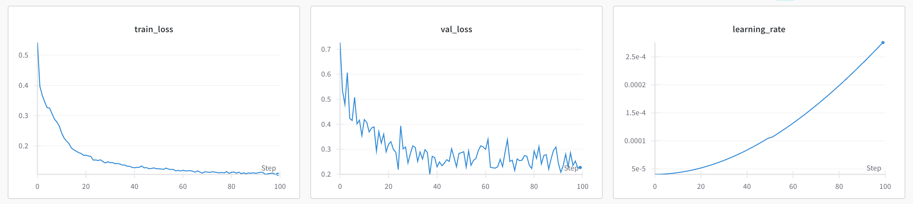
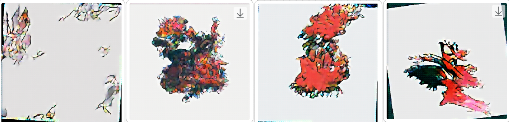
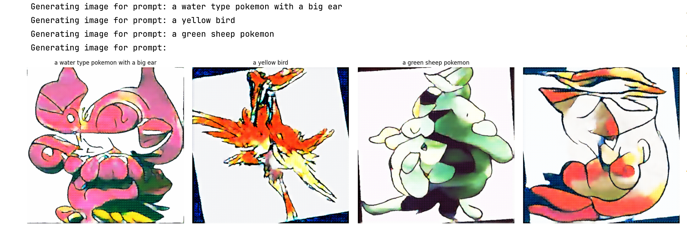
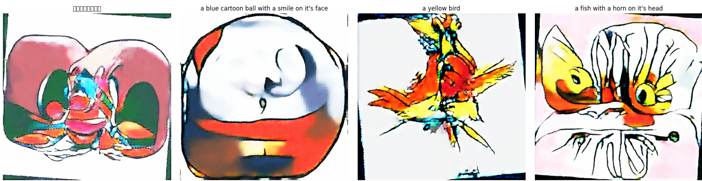

# 从零开始实现 Stable Diffusion 模型

使用了一个800张照片的 [pokemon](https://huggingface.co/datasets/svjack/pokemon-blip-captions-en-zh) 的小规模图片数据集。其中600张用作训练（通过数据增强）、200张用作验证。

由于是从零训练并没有依赖任何预训练的模型，数据集也较小，效果不用在乎，只需关注实现原理并作为教学示例。

教学视频是循序渐进的，这个文件夹下的代码内容已经整合包含了 `vae_from_scratch/` 和 `ddpm_from_scratch/` 两部分文件夹下的内容，实现了一个完整的SD2.x模型架构：

- 通过VAE将原始图片（3通道彩色 x 512高 x 512宽）压缩成潜在空间表示 (Latent dimension：4 x 64 x 64）；
- 将潜在空间表示（ 4 x 64 x 64 ）传递给 DDPM 架构进行噪声预测的训练；
- 训练完成的 DDPM 模型可生成带有文字条件的潜在空间表示；
- 通过VAE将潜在空间表示解码恢复成像素空间图片。

训练大概需要2～4小时。如果要达到更好的效果，则需使用更大的数据集和算力。

#### 关于损失值：

计算潜在空间的均方误差损失、多样性损失、一致性损失来协调总损失。

训练图片首先被我们之前视频里的预训练VAE模型（`var_from_scratch`文件夹下）压缩放成了4x64x64的潜在空间表示。再在潜在空间训练噪声预测。并通过VAE重构成3x512x512像素空间的图片。

由于这个例子中的pokemon数据集相对较小，模型的泛化能力较差。要想达到更完美的生成效果，个人能力认为智能增加更多pokemon训练集图片数量。因为加入文本嵌入条件之后做到生成的泛化，800张图片是远远不够的（参考SD2的训练集数量是1亿张以上）。

- Learning rate 及 训练损失：

- 

#### 需要安装的库：
```
numpy
torch
torchvision
Pillow
datasets
transformers
PIL
tdqm
datasets
```

#### 训练图片数据集：

运行`train_stable_diffusion.py`会从huggingface上下载一个[pokemon](https://huggingface.co/datasets/svjack/pokemon-blip-captions-en-zh)的小规模图片数据集。

当然，你也可以在代码中替换成本地的其他图片数据集。

#### 训练Epoch过程中的样本图片生成：

随着训练epoch过程，通过潜在空间生成（带文字条件）的512x512图片会越来越清晰。

> `文本条件 = "a dragon character with tail"`
> 
> `epoch 1, 30, 60, 90,` 生成的图片如下（可以看到学习的过程）：



#### 训练完成后模型生成：

模型训练完成后，运行 `sample_stable_diffusion.ipynb` 可以生成一些图片。

> 1. `文本条件`
> - "a water type pokemon with a big ear",
> - "a yellow bird",
> - "a green sheep pokemon",
> - "" （无文本条件）



> 2. `文本条件`
> - "一只大耳朵的小鸟",
> - "a blue cartoon ball with a smile on it's face",
> - "a yellow bird",
> - "a fish with a horn on it's head"



#### 模型结构：
```python
StableDiffusion(
  (vae): VAE(
    (encoder): Sequential(
      (0): Sequential(
        (0): Conv2d(3, 64, kernel_size=(3, 3), stride=(2, 2), padding=(1, 1))
        (1): BatchNorm2d(64, eps=1e-05, momentum=0.1, affine=True, track_running_stats=True)
        (2): LeakyReLU(negative_slope=0.2)
      )
      (1): Sequential(
        (0): Conv2d(64, 128, kernel_size=(3, 3), stride=(2, 2), padding=(1, 1))
        (1): BatchNorm2d(128, eps=1e-05, momentum=0.1, affine=True, track_running_stats=True)
        (2): LeakyReLU(negative_slope=0.2)
      )
      (2): Sequential(
        (0): Conv2d(128, 256, kernel_size=(3, 3), stride=(2, 2), padding=(1, 1))
        (1): BatchNorm2d(256, eps=1e-05, momentum=0.1, affine=True, track_running_stats=True)
        (2): LeakyReLU(negative_slope=0.2)
      )
    )
    (fc_mu): Conv2d(256, 4, kernel_size=(1, 1), stride=(1, 1))
    (fc_var): Conv2d(256, 4, kernel_size=(1, 1), stride=(1, 1))
    (decoder_input): ConvTranspose2d(4, 256, kernel_size=(1, 1), stride=(1, 1))
    (decoder): Sequential(
      (0): Sequential(
        (0): ConvTranspose2d(256, 128, kernel_size=(3, 3), stride=(2, 2), padding=(1, 1), output_padding=(1, 1))
        (1): BatchNorm2d(128, eps=1e-05, momentum=0.1, affine=True, track_running_stats=True)
        (2): LeakyReLU(negative_slope=0.2)
      )
      (1): Sequential(
        (0): ConvTranspose2d(128, 64, kernel_size=(3, 3), stride=(2, 2), padding=(1, 1), output_padding=(1, 1))
        (1): BatchNorm2d(64, eps=1e-05, momentum=0.1, affine=True, track_running_stats=True)
        (2): LeakyReLU(negative_slope=0.2)
      )
      (2): Sequential(
        (0): ConvTranspose2d(64, 3, kernel_size=(3, 3), stride=(2, 2), padding=(1, 1), output_padding=(1, 1))
        (1): BatchNorm2d(3, eps=1e-05, momentum=0.1, affine=True, track_running_stats=True)
        (2): LeakyReLU(negative_slope=0.2)
      )
    )
    (sigmoid): Sigmoid()
    (tanh): Tanh()
  )
  (unet): UNet_Transformer(
    (time_mlp): Sequential(
      (0): Linear(in_features=256, out_features=1024, bias=True)
      (1): SiLU()
      (2): Linear(in_features=1024, out_features=256, bias=True)
    )
    (init_conv): Sequential(
      (0): Conv2d(4, 64, kernel_size=(3, 3), stride=(1, 1), padding=(1, 1))
      (1): SiLU()
      (2): Conv2d(64, 64, kernel_size=(3, 3), stride=(1, 1), padding=(1, 1))
    )
    (down1): DownBlock(
      (resnet1): ResnetBlock(
        (norm1): GroupNorm(4, 64, eps=1e-06, affine=True)
        (norm2): GroupNorm(4, 128, eps=1e-06, affine=True)
        (conv1): Conv2d(64, 128, kernel_size=(3, 3), stride=(1, 1), padding=(1, 1))
        (conv2): Conv2d(128, 128, kernel_size=(3, 3), stride=(1, 1), padding=(1, 1))
        (activation): SiLU()
        (residual_conv): Conv2d(64, 128, kernel_size=(1, 1), stride=(1, 1))
        (dropout): Dropout(p=0.1, inplace=False)
        (time_proj): Linear(in_features=256, out_features=128, bias=True)
      )
      (transformer1): SpatialTransformer(
        (transformer): TransformerBlock(
          (attn_self): Attention(
            (query): Linear(in_features=128, out_features=128, bias=False)
            (key): Linear(in_features=128, out_features=128, bias=False)
            (value): Linear(in_features=128, out_features=128, bias=False)
            (out_proj): Linear(in_features=128, out_features=128, bias=True)
          )
          (norm1): LayerNorm((128,), eps=1e-05, elementwise_affine=True)
          (norm2): LayerNorm((128,), eps=1e-05, elementwise_affine=True)
          (norm3): LayerNorm((128,), eps=1e-05, elementwise_affine=True)
          (norm4): LayerNorm((128,), eps=1e-05, elementwise_affine=True)
          (ffn1): Sequential(
            (0): Linear(in_features=128, out_features=512, bias=True)
            (1): GELU(approximate='none')
            (2): Linear(in_features=512, out_features=128, bias=True)
            (3): Dropout(p=0.1, inplace=False)
          )
          (ffn2): Sequential(
            (0): Linear(in_features=128, out_features=512, bias=True)
            (1): GELU(approximate='none')
            (2): Linear(in_features=512, out_features=128, bias=True)
            (3): Dropout(p=0.1, inplace=False)
          )
        )
        (context_proj): Linear(in_features=512, out_features=128, bias=True)
      )
      (resnet2): ResnetBlock(
        (norm1): GroupNorm(4, 128, eps=1e-06, affine=True)
        (norm2): GroupNorm(4, 128, eps=1e-06, affine=True)
        (conv1): Conv2d(128, 128, kernel_size=(3, 3), stride=(1, 1), padding=(1, 1))
        (conv2): Conv2d(128, 128, kernel_size=(3, 3), stride=(1, 1), padding=(1, 1))
        (activation): SiLU()
        (residual_conv): Identity()
        (dropout): Dropout(p=0.1, inplace=False)
        (time_proj): Linear(in_features=256, out_features=128, bias=True)
      )
      (downsample): Conv2d(128, 128, kernel_size=(3, 3), stride=(2, 2), padding=(1, 1))
    )
    (down2): DownBlock(
      (resnet1): ResnetBlock(
        (norm1): GroupNorm(4, 128, eps=1e-06, affine=True)
        (norm2): GroupNorm(4, 256, eps=1e-06, affine=True)
        (conv1): Conv2d(128, 256, kernel_size=(3, 3), stride=(1, 1), padding=(1, 1))
        (conv2): Conv2d(256, 256, kernel_size=(3, 3), stride=(1, 1), padding=(1, 1))
        (activation): SiLU()
        (residual_conv): Conv2d(128, 256, kernel_size=(1, 1), stride=(1, 1))
        (dropout): Dropout(p=0.1, inplace=False)
        (time_proj): Linear(in_features=256, out_features=256, bias=True)
      )
      (transformer1): SpatialTransformer(
        (transformer): TransformerBlock(
          (attn_self): Attention(
            (query): Linear(in_features=256, out_features=256, bias=False)
            (key): Linear(in_features=256, out_features=256, bias=False)
            (value): Linear(in_features=256, out_features=256, bias=False)
            (out_proj): Linear(in_features=256, out_features=256, bias=True)
          )
          (norm1): LayerNorm((256,), eps=1e-05, elementwise_affine=True)
          (norm2): LayerNorm((256,), eps=1e-05, elementwise_affine=True)
          (norm3): LayerNorm((256,), eps=1e-05, elementwise_affine=True)
          (norm4): LayerNorm((256,), eps=1e-05, elementwise_affine=True)
          (ffn1): Sequential(
            (0): Linear(in_features=256, out_features=1024, bias=True)
            (1): GELU(approximate='none')
            (2): Linear(in_features=1024, out_features=256, bias=True)
            (3): Dropout(p=0.1, inplace=False)
          )
          (ffn2): Sequential(
            (0): Linear(in_features=256, out_features=1024, bias=True)
            (1): GELU(approximate='none')
            (2): Linear(in_features=1024, out_features=256, bias=True)
            (3): Dropout(p=0.1, inplace=False)
          )
        )
        (context_proj): Linear(in_features=512, out_features=256, bias=True)
      )
      (resnet2): ResnetBlock(
        (norm1): GroupNorm(4, 256, eps=1e-06, affine=True)
        (norm2): GroupNorm(4, 256, eps=1e-06, affine=True)
        (conv1): Conv2d(256, 256, kernel_size=(3, 3), stride=(1, 1), padding=(1, 1))
        (conv2): Conv2d(256, 256, kernel_size=(3, 3), stride=(1, 1), padding=(1, 1))
        (activation): SiLU()
        (residual_conv): Identity()
        (dropout): Dropout(p=0.1, inplace=False)
        (time_proj): Linear(in_features=256, out_features=256, bias=True)
      )
      (downsample): Conv2d(256, 256, kernel_size=(3, 3), stride=(2, 2), padding=(1, 1))
    )
    (down3): DownBlock(
      (resnet1): ResnetBlock(
        (norm1): GroupNorm(4, 256, eps=1e-06, affine=True)
        (norm2): GroupNorm(4, 512, eps=1e-06, affine=True)
        (conv1): Conv2d(256, 512, kernel_size=(3, 3), stride=(1, 1), padding=(1, 1))
        (conv2): Conv2d(512, 512, kernel_size=(3, 3), stride=(1, 1), padding=(1, 1))
        (activation): SiLU()
        (residual_conv): Conv2d(256, 512, kernel_size=(1, 1), stride=(1, 1))
        (dropout): Dropout(p=0.1, inplace=False)
        (time_proj): Linear(in_features=256, out_features=512, bias=True)
      )
      (transformer1): SpatialTransformer(
        (transformer): TransformerBlock(
          (attn_self): Attention(
            (query): Linear(in_features=512, out_features=512, bias=False)
            (key): Linear(in_features=512, out_features=512, bias=False)
            (value): Linear(in_features=512, out_features=512, bias=False)
            (out_proj): Linear(in_features=512, out_features=512, bias=True)
          )
          (norm1): LayerNorm((512,), eps=1e-05, elementwise_affine=True)
          (norm2): LayerNorm((512,), eps=1e-05, elementwise_affine=True)
          (norm3): LayerNorm((512,), eps=1e-05, elementwise_affine=True)
          (norm4): LayerNorm((512,), eps=1e-05, elementwise_affine=True)
          (ffn1): Sequential(
            (0): Linear(in_features=512, out_features=2048, bias=True)
            (1): GELU(approximate='none')
            (2): Linear(in_features=2048, out_features=512, bias=True)
            (3): Dropout(p=0.1, inplace=False)
          )
          (ffn2): Sequential(
            (0): Linear(in_features=512, out_features=2048, bias=True)
            (1): GELU(approximate='none')
            (2): Linear(in_features=2048, out_features=512, bias=True)
            (3): Dropout(p=0.1, inplace=False)
          )
        )
        (context_proj): Identity()
      )
      (resnet2): ResnetBlock(
        (norm1): GroupNorm(4, 512, eps=1e-06, affine=True)
        (norm2): GroupNorm(4, 512, eps=1e-06, affine=True)
        (conv1): Conv2d(512, 512, kernel_size=(3, 3), stride=(1, 1), padding=(1, 1))
        (conv2): Conv2d(512, 512, kernel_size=(3, 3), stride=(1, 1), padding=(1, 1))
        (activation): SiLU()
        (residual_conv): Identity()
        (dropout): Dropout(p=0.1, inplace=False)
        (time_proj): Linear(in_features=256, out_features=512, bias=True)
      )
      (downsample): Conv2d(512, 512, kernel_size=(3, 3), stride=(2, 2), padding=(1, 1))
    )
    (middle_block): MiddleBlock(
      (resnet1): ResnetBlock(
        (norm1): GroupNorm(4, 512, eps=1e-06, affine=True)
        (norm2): GroupNorm(4, 512, eps=1e-06, affine=True)
        (conv1): Conv2d(512, 512, kernel_size=(3, 3), stride=(1, 1), padding=(1, 1))
        (conv2): Conv2d(512, 512, kernel_size=(3, 3), stride=(1, 1), padding=(1, 1))
        (activation): SiLU()
        (residual_conv): Identity()
        (dropout): Dropout(p=0.1, inplace=False)
        (time_proj): Linear(in_features=256, out_features=512, bias=True)
      )
      (attn1): SpatialTransformer(
        (transformer): TransformerBlock(
          (attn_self): Attention(
            (query): Linear(in_features=512, out_features=512, bias=False)
            (key): Linear(in_features=512, out_features=512, bias=False)
            (value): Linear(in_features=512, out_features=512, bias=False)
            (out_proj): Linear(in_features=512, out_features=512, bias=True)
          )
          (attn_cross): Attention(
            (query): Linear(in_features=512, out_features=512, bias=False)
            (key): Linear(in_features=512, out_features=512, bias=False)
            (value): Linear(in_features=512, out_features=512, bias=False)
            (out_proj): Linear(in_features=512, out_features=512, bias=True)
          )
          (norm1): LayerNorm((512,), eps=1e-05, elementwise_affine=True)
          (norm2): LayerNorm((512,), eps=1e-05, elementwise_affine=True)
          (norm3): LayerNorm((512,), eps=1e-05, elementwise_affine=True)
          (norm4): LayerNorm((512,), eps=1e-05, elementwise_affine=True)
          (ffn1): Sequential(
            (0): Linear(in_features=512, out_features=2048, bias=True)
            (1): GELU(approximate='none')
            (2): Linear(in_features=2048, out_features=512, bias=True)
            (3): Dropout(p=0.1, inplace=False)
          )
          (ffn2): Sequential(
            (0): Linear(in_features=512, out_features=2048, bias=True)
            (1): GELU(approximate='none')
            (2): Linear(in_features=2048, out_features=512, bias=True)
            (3): Dropout(p=0.1, inplace=False)
          )
        )
        (context_proj): Identity()
      )
      (resnet2): ResnetBlock(
        (norm1): GroupNorm(4, 512, eps=1e-06, affine=True)
        (norm2): GroupNorm(4, 512, eps=1e-06, affine=True)
        (conv1): Conv2d(512, 512, kernel_size=(3, 3), stride=(1, 1), padding=(1, 1))
        (conv2): Conv2d(512, 512, kernel_size=(3, 3), stride=(1, 1), padding=(1, 1))
        (activation): SiLU()
        (residual_conv): Identity()
        (dropout): Dropout(p=0.1, inplace=False)
        (time_proj): Linear(in_features=256, out_features=512, bias=True)
      )
      (attn2): SpatialTransformer(
        (transformer): TransformerBlock(
          (attn_self): Attention(
            (query): Linear(in_features=512, out_features=512, bias=False)
            (key): Linear(in_features=512, out_features=512, bias=False)
            (value): Linear(in_features=512, out_features=512, bias=False)
            (out_proj): Linear(in_features=512, out_features=512, bias=True)
          )
          (attn_cross): Attention(
            (query): Linear(in_features=512, out_features=512, bias=False)
            (key): Linear(in_features=512, out_features=512, bias=False)
            (value): Linear(in_features=512, out_features=512, bias=False)
            (out_proj): Linear(in_features=512, out_features=512, bias=True)
          )
          (norm1): LayerNorm((512,), eps=1e-05, elementwise_affine=True)
          (norm2): LayerNorm((512,), eps=1e-05, elementwise_affine=True)
          (norm3): LayerNorm((512,), eps=1e-05, elementwise_affine=True)
          (norm4): LayerNorm((512,), eps=1e-05, elementwise_affine=True)
          (ffn1): Sequential(
            (0): Linear(in_features=512, out_features=2048, bias=True)
            (1): GELU(approximate='none')
            (2): Linear(in_features=2048, out_features=512, bias=True)
            (3): Dropout(p=0.1, inplace=False)
          )
          (ffn2): Sequential(
            (0): Linear(in_features=512, out_features=2048, bias=True)
            (1): GELU(approximate='none')
            (2): Linear(in_features=2048, out_features=512, bias=True)
            (3): Dropout(p=0.1, inplace=False)
          )
        )
        (context_proj): Identity()
      )
      (resnet3): ResnetBlock(
        (norm1): GroupNorm(4, 512, eps=1e-06, affine=True)
        (norm2): GroupNorm(4, 512, eps=1e-06, affine=True)
        (conv1): Conv2d(512, 512, kernel_size=(3, 3), stride=(1, 1), padding=(1, 1))
        (conv2): Conv2d(512, 512, kernel_size=(3, 3), stride=(1, 1), padding=(1, 1))
        (activation): SiLU()
        (residual_conv): Identity()
        (dropout): Dropout(p=0.1, inplace=False)
        (time_proj): Linear(in_features=256, out_features=512, bias=True)
      )
    )
    (up1): UpBlock(
      (upsample): ConvTranspose2d(512, 256, kernel_size=(4, 4), stride=(2, 2), padding=(1, 1))
      (resnet1): ResnetBlock(
        (norm1): GroupNorm(4, 256, eps=1e-06, affine=True)
        (norm2): GroupNorm(4, 256, eps=1e-06, affine=True)
        (conv1): Conv2d(256, 256, kernel_size=(3, 3), stride=(1, 1), padding=(1, 1))
        (conv2): Conv2d(256, 256, kernel_size=(3, 3), stride=(1, 1), padding=(1, 1))
        (activation): SiLU()
        (residual_conv): Identity()
        (dropout): Dropout(p=0.1, inplace=False)
        (time_proj): Linear(in_features=256, out_features=256, bias=True)
      )
      (transformer1): SpatialTransformer(
        (transformer): TransformerBlock(
          (attn_self): Attention(
            (query): Linear(in_features=256, out_features=256, bias=False)
            (key): Linear(in_features=256, out_features=256, bias=False)
            (value): Linear(in_features=256, out_features=256, bias=False)
            (out_proj): Linear(in_features=256, out_features=256, bias=True)
          )
          (norm1): LayerNorm((256,), eps=1e-05, elementwise_affine=True)
          (norm2): LayerNorm((256,), eps=1e-05, elementwise_affine=True)
          (norm3): LayerNorm((256,), eps=1e-05, elementwise_affine=True)
          (norm4): LayerNorm((256,), eps=1e-05, elementwise_affine=True)
          (ffn1): Sequential(
            (0): Linear(in_features=256, out_features=1024, bias=True)
            (1): GELU(approximate='none')
            (2): Linear(in_features=1024, out_features=256, bias=True)
            (3): Dropout(p=0.1, inplace=False)
          )
          (ffn2): Sequential(
            (0): Linear(in_features=256, out_features=1024, bias=True)
            (1): GELU(approximate='none')
            (2): Linear(in_features=1024, out_features=256, bias=True)
            (3): Dropout(p=0.1, inplace=False)
          )
        )
        (context_proj): Linear(in_features=512, out_features=256, bias=True)
      )
      (resnet2): ResnetBlock(
        (norm1): GroupNorm(4, 256, eps=1e-06, affine=True)
        (norm2): GroupNorm(4, 256, eps=1e-06, affine=True)
        (conv1): Conv2d(256, 256, kernel_size=(3, 3), stride=(1, 1), padding=(1, 1))
        (conv2): Conv2d(256, 256, kernel_size=(3, 3), stride=(1, 1), padding=(1, 1))
        (activation): SiLU()
        (residual_conv): Identity()
        (dropout): Dropout(p=0.1, inplace=False)
        (time_proj): Linear(in_features=256, out_features=256, bias=True)
      )
      (transformer2): SpatialTransformer(
        (transformer): TransformerBlock(
          (attn_cross): Attention(
            (query): Linear(in_features=256, out_features=256, bias=False)
            (key): Linear(in_features=512, out_features=256, bias=False)
            (value): Linear(in_features=512, out_features=256, bias=False)
            (out_proj): Linear(in_features=256, out_features=256, bias=True)
          )
          (norm1): LayerNorm((256,), eps=1e-05, elementwise_affine=True)
          (norm2): LayerNorm((256,), eps=1e-05, elementwise_affine=True)
          (norm3): LayerNorm((256,), eps=1e-05, elementwise_affine=True)
          (norm4): LayerNorm((256,), eps=1e-05, elementwise_affine=True)
          (ffn1): Sequential(
            (0): Linear(in_features=256, out_features=1024, bias=True)
            (1): GELU(approximate='none')
            (2): Linear(in_features=1024, out_features=256, bias=True)
            (3): Dropout(p=0.1, inplace=False)
          )
          (ffn2): Sequential(
            (0): Linear(in_features=256, out_features=1024, bias=True)
            (1): GELU(approximate='none')
            (2): Linear(in_features=1024, out_features=256, bias=True)
            (3): Dropout(p=0.1, inplace=False)
          )
        )
        (context_proj): Linear(in_features=512, out_features=256, bias=True)
      )
      (resnet3): ResnetBlock(
        (norm1): GroupNorm(4, 256, eps=1e-06, affine=True)
        (norm2): GroupNorm(4, 256, eps=1e-06, affine=True)
        (conv1): Conv2d(256, 256, kernel_size=(3, 3), stride=(1, 1), padding=(1, 1))
        (conv2): Conv2d(256, 256, kernel_size=(3, 3), stride=(1, 1), padding=(1, 1))
        (activation): SiLU()
        (residual_conv): Identity()
        (dropout): Dropout(p=0.1, inplace=False)
        (time_proj): Linear(in_features=256, out_features=256, bias=True)
      )
    )
    (up2): UpBlock(
      (upsample): ConvTranspose2d(512, 128, kernel_size=(4, 4), stride=(2, 2), padding=(1, 1))
      (resnet1): ResnetBlock(
        (norm1): GroupNorm(4, 128, eps=1e-06, affine=True)
        (norm2): GroupNorm(4, 128, eps=1e-06, affine=True)
        (conv1): Conv2d(128, 128, kernel_size=(3, 3), stride=(1, 1), padding=(1, 1))
        (conv2): Conv2d(128, 128, kernel_size=(3, 3), stride=(1, 1), padding=(1, 1))
        (activation): SiLU()
        (residual_conv): Identity()
        (dropout): Dropout(p=0.1, inplace=False)
        (time_proj): Linear(in_features=256, out_features=128, bias=True)
      )
      (transformer1): SpatialTransformer(
        (transformer): TransformerBlock(
          (attn_self): Attention(
            (query): Linear(in_features=128, out_features=128, bias=False)
            (key): Linear(in_features=128, out_features=128, bias=False)
            (value): Linear(in_features=128, out_features=128, bias=False)
            (out_proj): Linear(in_features=128, out_features=128, bias=True)
          )
          (norm1): LayerNorm((128,), eps=1e-05, elementwise_affine=True)
          (norm2): LayerNorm((128,), eps=1e-05, elementwise_affine=True)
          (norm3): LayerNorm((128,), eps=1e-05, elementwise_affine=True)
          (norm4): LayerNorm((128,), eps=1e-05, elementwise_affine=True)
          (ffn1): Sequential(
            (0): Linear(in_features=128, out_features=512, bias=True)
            (1): GELU(approximate='none')
            (2): Linear(in_features=512, out_features=128, bias=True)
            (3): Dropout(p=0.1, inplace=False)
          )
          (ffn2): Sequential(
            (0): Linear(in_features=128, out_features=512, bias=True)
            (1): GELU(approximate='none')
            (2): Linear(in_features=512, out_features=128, bias=True)
            (3): Dropout(p=0.1, inplace=False)
          )
        )
        (context_proj): Linear(in_features=512, out_features=128, bias=True)
      )
      (resnet2): ResnetBlock(
        (norm1): GroupNorm(4, 128, eps=1e-06, affine=True)
        (norm2): GroupNorm(4, 128, eps=1e-06, affine=True)
        (conv1): Conv2d(128, 128, kernel_size=(3, 3), stride=(1, 1), padding=(1, 1))
        (conv2): Conv2d(128, 128, kernel_size=(3, 3), stride=(1, 1), padding=(1, 1))
        (activation): SiLU()
        (residual_conv): Identity()
        (dropout): Dropout(p=0.1, inplace=False)
        (time_proj): Linear(in_features=256, out_features=128, bias=True)
      )
      (transformer2): SpatialTransformer(
        (transformer): TransformerBlock(
          (attn_cross): Attention(
            (query): Linear(in_features=128, out_features=128, bias=False)
            (key): Linear(in_features=512, out_features=128, bias=False)
            (value): Linear(in_features=512, out_features=128, bias=False)
            (out_proj): Linear(in_features=128, out_features=128, bias=True)
          )
          (norm1): LayerNorm((128,), eps=1e-05, elementwise_affine=True)
          (norm2): LayerNorm((128,), eps=1e-05, elementwise_affine=True)
          (norm3): LayerNorm((128,), eps=1e-05, elementwise_affine=True)
          (norm4): LayerNorm((128,), eps=1e-05, elementwise_affine=True)
          (ffn1): Sequential(
            (0): Linear(in_features=128, out_features=512, bias=True)
            (1): GELU(approximate='none')
            (2): Linear(in_features=512, out_features=128, bias=True)
            (3): Dropout(p=0.1, inplace=False)
          )
          (ffn2): Sequential(
            (0): Linear(in_features=128, out_features=512, bias=True)
            (1): GELU(approximate='none')
            (2): Linear(in_features=512, out_features=128, bias=True)
            (3): Dropout(p=0.1, inplace=False)
          )
        )
        (context_proj): Linear(in_features=512, out_features=128, bias=True)
      )
      (resnet3): ResnetBlock(
        (norm1): GroupNorm(4, 128, eps=1e-06, affine=True)
        (norm2): GroupNorm(4, 128, eps=1e-06, affine=True)
        (conv1): Conv2d(128, 128, kernel_size=(3, 3), stride=(1, 1), padding=(1, 1))
        (conv2): Conv2d(128, 128, kernel_size=(3, 3), stride=(1, 1), padding=(1, 1))
        (activation): SiLU()
        (residual_conv): Identity()
        (dropout): Dropout(p=0.1, inplace=False)
        (time_proj): Linear(in_features=256, out_features=128, bias=True)
      )
    )
    (up3): UpBlock(
      (upsample): ConvTranspose2d(256, 64, kernel_size=(4, 4), stride=(2, 2), padding=(1, 1))
      (resnet1): ResnetBlock(
        (norm1): GroupNorm(4, 64, eps=1e-06, affine=True)
        (norm2): GroupNorm(4, 64, eps=1e-06, affine=True)
        (conv1): Conv2d(64, 64, kernel_size=(3, 3), stride=(1, 1), padding=(1, 1))
        (conv2): Conv2d(64, 64, kernel_size=(3, 3), stride=(1, 1), padding=(1, 1))
        (activation): SiLU()
        (residual_conv): Identity()
        (dropout): Dropout(p=0.1, inplace=False)
        (time_proj): Linear(in_features=256, out_features=64, bias=True)
      )
      (transformer1): SpatialTransformer(
        (transformer): TransformerBlock(
          (attn_self): Attention(
            (query): Linear(in_features=64, out_features=64, bias=False)
            (key): Linear(in_features=64, out_features=64, bias=False)
            (value): Linear(in_features=64, out_features=64, bias=False)
            (out_proj): Linear(in_features=64, out_features=64, bias=True)
          )
          (norm1): LayerNorm((64,), eps=1e-05, elementwise_affine=True)
          (norm2): LayerNorm((64,), eps=1e-05, elementwise_affine=True)
          (norm3): LayerNorm((64,), eps=1e-05, elementwise_affine=True)
          (norm4): LayerNorm((64,), eps=1e-05, elementwise_affine=True)
          (ffn1): Sequential(
            (0): Linear(in_features=64, out_features=256, bias=True)
            (1): GELU(approximate='none')
            (2): Linear(in_features=256, out_features=64, bias=True)
            (3): Dropout(p=0.1, inplace=False)
          )
          (ffn2): Sequential(
            (0): Linear(in_features=64, out_features=256, bias=True)
            (1): GELU(approximate='none')
            (2): Linear(in_features=256, out_features=64, bias=True)
            (3): Dropout(p=0.1, inplace=False)
          )
        )
        (context_proj): Linear(in_features=512, out_features=64, bias=True)
      )
      (resnet2): ResnetBlock(
        (norm1): GroupNorm(4, 64, eps=1e-06, affine=True)
        (norm2): GroupNorm(4, 64, eps=1e-06, affine=True)
        (conv1): Conv2d(64, 64, kernel_size=(3, 3), stride=(1, 1), padding=(1, 1))
        (conv2): Conv2d(64, 64, kernel_size=(3, 3), stride=(1, 1), padding=(1, 1))
        (activation): SiLU()
        (residual_conv): Identity()
        (dropout): Dropout(p=0.1, inplace=False)
        (time_proj): Linear(in_features=256, out_features=64, bias=True)
      )
      (transformer2): SpatialTransformer(
        (transformer): TransformerBlock(
          (attn_cross): Attention(
            (query): Linear(in_features=64, out_features=64, bias=False)
            (key): Linear(in_features=512, out_features=64, bias=False)
            (value): Linear(in_features=512, out_features=64, bias=False)
            (out_proj): Linear(in_features=64, out_features=64, bias=True)
          )
          (norm1): LayerNorm((64,), eps=1e-05, elementwise_affine=True)
          (norm2): LayerNorm((64,), eps=1e-05, elementwise_affine=True)
          (norm3): LayerNorm((64,), eps=1e-05, elementwise_affine=True)
          (norm4): LayerNorm((64,), eps=1e-05, elementwise_affine=True)
          (ffn1): Sequential(
            (0): Linear(in_features=64, out_features=256, bias=True)
            (1): GELU(approximate='none')
            (2): Linear(in_features=256, out_features=64, bias=True)
            (3): Dropout(p=0.1, inplace=False)
          )
          (ffn2): Sequential(
            (0): Linear(in_features=64, out_features=256, bias=True)
            (1): GELU(approximate='none')
            (2): Linear(in_features=256, out_features=64, bias=True)
            (3): Dropout(p=0.1, inplace=False)
          )
        )
        (context_proj): Linear(in_features=512, out_features=64, bias=True)
      )
      (resnet3): ResnetBlock(
        (norm1): GroupNorm(4, 64, eps=1e-06, affine=True)
        (norm2): GroupNorm(4, 64, eps=1e-06, affine=True)
        (conv1): Conv2d(64, 64, kernel_size=(3, 3), stride=(1, 1), padding=(1, 1))
        (conv2): Conv2d(64, 64, kernel_size=(3, 3), stride=(1, 1), padding=(1, 1))
        (activation): SiLU()
        (residual_conv): Identity()
        (dropout): Dropout(p=0.1, inplace=False)
        (time_proj): Linear(in_features=256, out_features=64, bias=True)
      )
    )
    (final_conv): Sequential(
      (0): ResnetBlock(
        (norm1): GroupNorm(4, 128, eps=1e-06, affine=True)
        (norm2): GroupNorm(4, 64, eps=1e-06, affine=True)
        (conv1): Conv2d(128, 64, kernel_size=(3, 3), stride=(1, 1), padding=(1, 1))
        (conv2): Conv2d(64, 64, kernel_size=(3, 3), stride=(1, 1), padding=(1, 1))
        (activation): SiLU()
        (residual_conv): Conv2d(128, 64, kernel_size=(1, 1), stride=(1, 1))
        (dropout): Dropout(p=0.1, inplace=False)
        (time_proj): Linear(in_features=256, out_features=64, bias=True)
      )
      (1): Conv2d(64, 64, kernel_size=(3, 3), stride=(1, 1), padding=(1, 1))
      (2): SiLU()
      (3): Conv2d(64, 4, kernel_size=(3, 3), stride=(1, 1), padding=(1, 1))
    )
  )
)
```

```python
CLIPTextModel(
  (text_model): CLIPTextTransformer(
    (embeddings): CLIPTextEmbeddings(
      (token_embedding): Embedding(49408, 512)
      (position_embedding): Embedding(77, 512)
    )
    (encoder): CLIPEncoder(
      (layers): ModuleList(
        (0-11): 12 x CLIPEncoderLayer(
          (self_attn): CLIPSdpaAttention(
            (k_proj): Linear(in_features=512, out_features=512, bias=True)
            (v_proj): Linear(in_features=512, out_features=512, bias=True)
            (q_proj): Linear(in_features=512, out_features=512, bias=True)
            (out_proj): Linear(in_features=512, out_features=512, bias=True)
          )
          (layer_norm1): LayerNorm((512,), eps=1e-05, elementwise_affine=True)
          (mlp): CLIPMLP(
            (activation_fn): QuickGELUActivation()
            (fc1): Linear(in_features=512, out_features=2048, bias=True)
            (fc2): Linear(in_features=2048, out_features=512, bias=True)
          )
          (layer_norm2): LayerNorm((512,), eps=1e-05, elementwise_affine=True)
        )
      )
    )
    (final_layer_norm): LayerNorm((512,), eps=1e-05, elementwise_affine=True)
  )
)
```